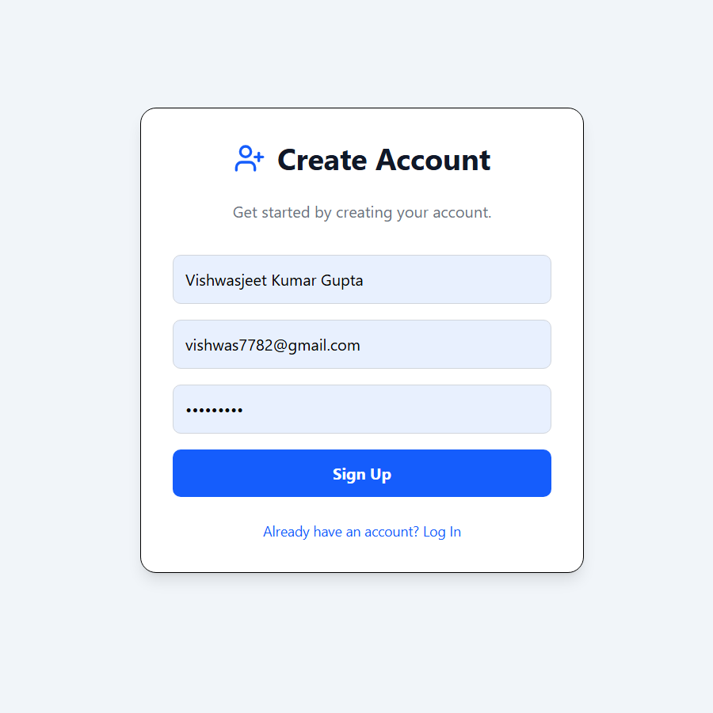

# Full Stack Developer Internship - Round 1 Task

This is a submission for the Round 1 task to build a fundraising intern portal. The portal features a dummy login/signup system, a dynamic dashboard displaying intern-specific data from a backend API, and a leaderboard of top performers.

The UI is designed to be clean, modern, and responsive, with a focus on providing clear feedback and a premium user experience through subtle animations and a consistent design system.

---

## Live Demo Links (Optional)
* **Frontend:** https://fundraising-intern-portal-gilt.vercel.app/
* **Backend:** https://fundraising-intern-portal-sxki.onrender.com

---

## Tech Stack

- **Frontend**: React (with Vite), Tailwind CSS, Framer Motion, Axios
- **Backend**: Node.js, Express.js
- **Database**: MongoDB (with Mongoose)

---

## Core Features

-   **Dummy Authentication:** A toggleable Login and Signup form UI.
-   **Dynamic Intern Dashboard:**
    -   Fetches and displays intern name, referral code, and total donations from the backend.
    -   Features a dynamic progress bar for unlockable rewards.
    -   Uses a responsive, card-based layout with hover effects and animations.
-   **Leaderboard:**
    -   Fetches and displays a sorted list of top-performing interns.
    -   Highlights the current user's position for easy recognition.
    -   Visually distinguishes the top 3 performers.

---

## How to Run Locally

### Prerequisites
- Node.js (v18+)
- npm / yarn
- MongoDB (local instance or a cloud URI from MongoDB Atlas)

### 1. Setup Backend
```bash
# Navigate to the server directory
cd server

# Install dependencies
npm install

# Create a .env file in the /server directory and add your variables
# MONGO_URI=your_mongodb_connection_string
# PORT=5001

# Start the development server
npm run dev
```

- **After starting, open a browser to http://localhost:5001/seed to populate the database with dummy data.**

### 2. Setup Frontend
```bash
# In a new terminal, navigate to the client directory
cd client

# Install dependencies
npm install

# Start the development server
npm run dev
```

- **The application will be available at http://localhost:5173**

---

## Screenshots

### Dashboard


---
### 🔄 Leaderboard


---

### Signup



---

### 🔄 Login


---


## 👨‍💻 Author

**Vishwasjeet Kumar Gupta**  
Salesforce Developer | B.Tech CSE | Passionate about CRM Solutions  
[LinkedIn Profile](https://www.linkedin.com/in/vishwasjeet-kumar-gupta-62814018a)

---
